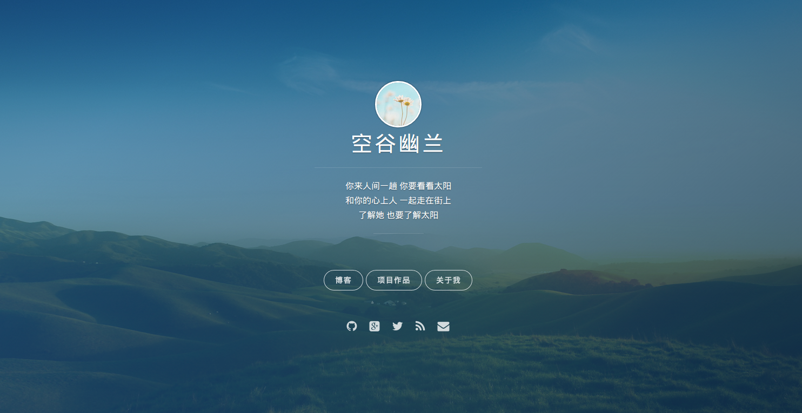
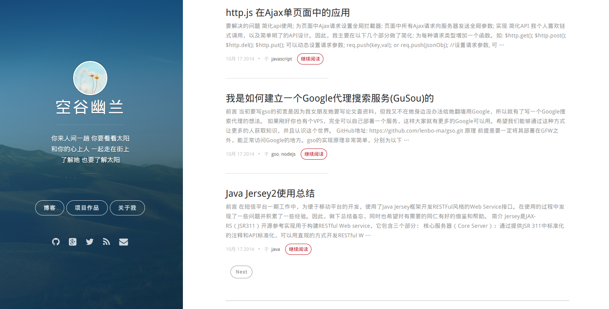

hexo-vno
========

这个主题是修改自[onevat的vno](https://github.com/onevcat/vno), 它遵从简洁和响应式的设计风格，拥有一个独立的封面，易于集成的 Disqus 评论和多说系统，Google Analytics,字体图标以及多种颜色。

## Demo Show

[Demo: 我的博客](http://mlongbo.com)






## 封面

### 图片和颜色

将您的封面图片放到主题的 source/images/ 下，将图片文件改名为background-cover.jpg或修改_config.iml中background的cover字段值即可。您也可以改变封面的颜色。找到_config.iml中background的color字段值,然后替换成您需要的颜色即可。默认为您提供了七种选择：

* `cover-blue` - #2568A3
* `cover-green` - #156F78
* `cover-purple` - #493252
* `cover-red` - #E25440
* `cover-orange` - #FB9C50
* `cover-slate` - #3D4260
* `cover-disabled` - 透明

### 头像和简介

头像可以在封面中显示,将头像文件放到主体的 source/images/下, 修改_config.yml中的logo字段值即可。

您还可以在封面页上写一个简短的介绍, 填写全局的_config.yml(注意:不是主题下的_config.yml)中的description字段值, 支持html标签。


## Installation

### Install

``` bash
$ git clone https://github.com/lenbo-ma/hexo-theme-vno.git themes/vno
```

### Enable

Modify `theme` setting in `_config.yml` to `vno`.

### Update

``` bash
cd themes/vno
git pull
```


## Configuration

```yml
# menu子菜单可随意配置
menu:
  #Archives: /archives
  项目作品: /projects
  关于我: /aboutme
rss: /atom.xml
# description配置内容会出现在meta标签中，因此会被搜索引擎抓取
description: 爱好电影、音乐和书籍，尤其喜爱许巍、李健及王小波。擅长Java，JavaScript，喜欢用NodeJs编写一些有趣的应用。关注互联网、科技、敏捷开发以及JavaNIO。
# 不填写的链接则不显示
social:
  weibo: http://weibo.com/p/1005052979439661
  github: https://github.com/lenbo-ma
  twitter: https://twitter.com/lenbo_
  google_plus: https://www.google.com/+LenboMa
# 封面中的头像
logo: /images/logo2.jpg
# cover处填写背景图片, color处填写覆盖层的颜色样式名
background:
  cover: /images/background-cover.jpg
  color: cover-blue

archive_date_format: MMM DD

# 多说的帐号名, 不配置则不启用
duoshuo_shortname: mlongbo

google_analytics: UA-42596364-1
# 网站的favicon图片
favicon: /favicon.ico
```
如果使用disqus，需要在hexo的全局配置文件中配置, duoshuo_shortname字段留空即可

## Copyright & License

Copyright (c) 2014-2015  Released under the [MIT license](LICENSE).
